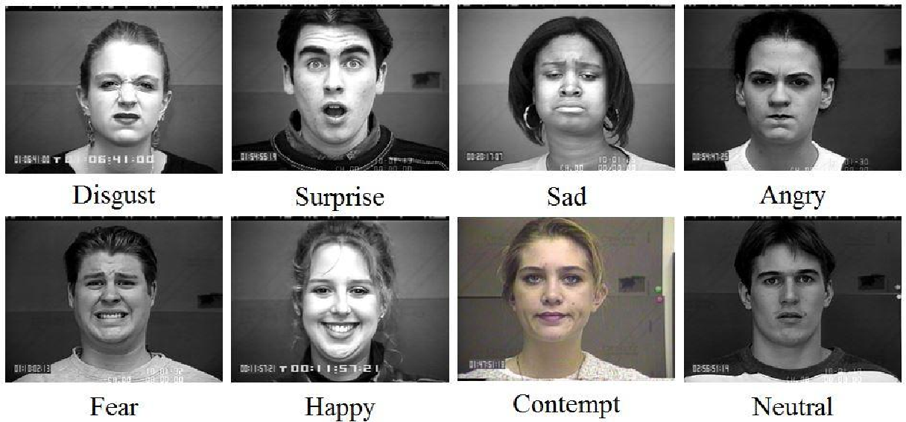
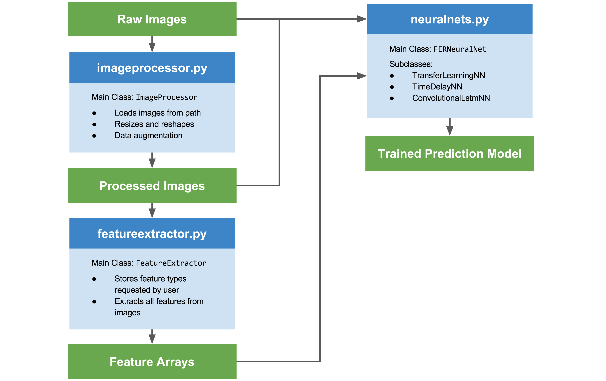

# EmoPy
EmoPy is a python toolkit with deep neural net classes which accurately predict emotions given images of people's faces.


*Figure from [@Chen2014FacialER]*

The aim of this project is to make accurate [Facial Expression Recognition (FER)](https://en.wikipedia.org/wiki/Emotion_recognition) models free, open, easy to use, and easy to integrate into different projects. We also aim to expand our development community, and we are open to suggestions and contributions. Please [contact us](mailto:aperez@thoughtworks.com) to discuss.

## Overview

EmoPy includes four primary modules that are plugged together to build a trained FER prediction model:

- `fermodel.py`
- `neuralnets.py`
- `imageprocessor.py`
- `featureextractor.py`

These modules all have only one class each, except for `neuralnets.py`, which has one interface and three subclasses:



The `fermodel` class operates all the other module classes shown above, making it the easiest entry point to get a trained model up and running quickly. As the diagram shows, the modules are designed to allow you to experiment with raw images, processed images, and feature extraction.

To dig further into the modules and classes, [read the EmoPy documentation](https://emopy.readthedocs.io/).

## Datasets

As of this moment, in order to use this repository you will have to provide your own facial expression image dataset. We aim to provide pre-trained prediction models in the near future, but for now you can try out the system using your own dataset or one of the small datasets we have provided in the [image-data](image-data) subdirectory.

Predictions ideally perform well on a diversity of datasets, illumination conditions, and subsets of the standard 7 emotion labels (happiness, anger, fear, surprise, disgust, sadness, calm/neutral) seen in FER research. Some good example public datasets are the [Extended Cohn-Kanade](http://www.consortium.ri.cmu.edu/ckagree/) and [FER+](https://github.com/Microsoft/FERPlus).

## Installation

To get started, clone the directory and open it in your terminal.

```
git clone https://github.com/thoughtworksarts/EmoPy.git
cd EmoPy
```

You will need to install Python 3.6.3. We recommend setting up a Python virtual environment using pyenv. Install pyenv with homebrew:

```
brew install pyenv
```

Next install Python 3.6.3 using pyenv and set it as the local distribution while in the fer-python directory:
```
pyenv install 3.6.3
pyenv local 3.6.3
```
 
Once Python 3.6.3 is set up, install the dependencies:

```
pip install -r requirements.txt
```

Now you're ready to go!

## Running the examples

You can find example code to run each of the current neural net classes in the [examples](examples) subdirectory. The [example](examples/fermodel_example.py) of the FERModel class, shown below, is so easy to use that all you have to supply is a set of target emotions and a data path. Eventually FERModel will choose the best-performing neural net based on the set of target emotions.

#### Example using FERModel:

```python
import sys
sys.path.append('../')
from fermodel import FERModel

target_emotions = ['anger', 'fear', 'neutral', 'sad', 'happy', 'surprise', 'disgust']
csv_file_path = "image_data/sample.csv"
model = FERModel(target_emotions, csv_data_path=csv_file_path, raw_dimensions=(48,48), csv_image_col=1, csv_label_col=0, verbose=True)
model.train()
```

The example above initializes and trains an FER deep neural net model for the target emotions listed using the sample images from the a small [csv dataset](examples/image_data/sample.csv). Once you have completed the installation step, you can run the example by moving into the examples folder and running the example script like so:

```
cd examples
python fermodel_example.py
```

When you run the example, you will see the training and validation accuracies of the model being updated as it is trained on each sample image. The validation accuracy will be very low since we are only using three images for training and validation. It should look something like this:


## Performance

Currently the ConvolutionalLstmNN model is performing best with a validation accuracy of 62.7% trained to classify three emotions. The table below shows accuracy values of this model and the TransferLearningNN model when trained on all seven standard emotions and on a subset of three emotions (fear, happiness, neutral). They were trained on 5,000 images from the [FER+](https://github.com/Microsoft/FERPlus) dataset. 

| Neural Net Model    | 7 emotions        |                     | 3 emotions        |                     |
|---------------------|-------------------|---------------------|-------------------|---------------------|
|                     | Training Accuracy | Validation Accuracy | Training Accuracy | Validation Accuracy |
| ConvolutionalLstmNN | 0.6187            | 0.4751              | 0.9148            | 0.6267              |
| TransferLearningNN  | 0.5358            | 0.2933              | 0.7393            | 0.4840              |

Both models are overfitting, meaning that training accuracies are much higher than validation accuracies. This means that the models are doing a really good job of recognizing and classifying patterns in the training images, but are overgeneralizing. They are less accurate when predicting emotions for new images.

If you would like to experiment with different parameters using our neural net classes, we recommend you use [FloydHub](https://www.floydhub.com/about), a platform for training and deploying deep learning models in the cloud. Let us know how your models are doing! The goal is to optimize the performance and generalizability of all the FERPython models.

## Guiding Principles

- __FER for Good__. FER applications have the potential to be used for malicious purposes. We want to build EmoPy with a community that champions integrity, transparency, and awareness and hope to instill these values throughout development while maintaining an accessible, quality toolkit.

- __User Friendliness.__ EmoPy prioritizes user experience and is designed to be as easy as possible to get an FER prediction model up and running by minimizing the total user requirements for basic use cases.

- __Experimentation to Maximize Performance__. Optimal performance in FER prediction is a primary goal. The deep neural net classes are designed to easily modify training parameters, image pre-processing options, and feature extraction methods in the hopes that experimentation in the open-source community will lead to high-performing FER prediction.

- __Modularity.__ EmoPy contains four base modules (fermodel, neuralnets, imageprocessor, and featureextractor) that can be easily used together with minimal restrictions. 

## Contributing

1. Fork it!
2. Create your feature branch: `git checkout -b my-new-feature`
3. Commit your changes: `git commit -am 'Add some feature'`
4. Push to the branch: `git push origin my-new-feature`
5. Submit a pull request :D

This is a new library that has a lot of room for growth. Check out the list of open issues that we need help addressing! 

[@Chen2014FacialER]: https://www.semanticscholar.org/paper/Facial-Expression-Recognition-Based-on-Facial-Comp-Chen-Chen/677ebde61ba3936b805357e27fce06c44513a455 "Facial Expression Recognition Based on Facial Components Detection and HOG Features"